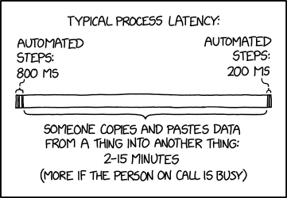

```{r setup, include=FALSE}
knitr::opts_chunk$set()
```

## R and R Markdown

- Tools for reproducible data analysis and reporting
- reproducible, adj. - Capable of being reproduced at a different time or place and by different people.
- R: data analysis, Rmarkdown: data reporting
  - 
- Rmarkdown $\approx$ R + [markdown](https://github.com/adam-p/markdown-here/wiki/Markdown-Cheatsheet)

## Reproducible Data Analysis

- The point of Statistics is providing evidence
- What if all of your evidence involves a heaping load of "take my word on it"?
- Prevent this by providing the tools to reproduce your evidence along with your evidence!

## Slide with R Output

```{r cars, echo = TRUE}
summary(cars)
```

## Slide with Plot

```{r pressure}
plot(pressure)
```

## Examples

- [Rpubs](https://rpubs.com/) is a really great place to find examples.
- Unfortunately, Rpubs doesn't also publish the source, which misses the point...
  - [Research-quality article](https://rpubs.com/Ian_W_Richardson/Twitter_Irish_Politics)
  - [Could use a better story](https://rpubs.com/cxh190001/854362)
  - [Also needs better story](https://rpubs.com/silasselfe/Moneyball)
  - [Nice article](https://rpubs.com/toldham2/babynames)
  - [Useful story](https://rpubs.com/Loudc951/848176)
  - [Nice article](https://rpubs.com/samanthallee/facebook-misinformation)
  - [Similar to our Final Project](https://rpubs.com/Felicia_Irawan/848558)
  - [Similar to our Final Project...needs more](https://rpubs.com/Ethan_Kostynick/849754)
  
## More info on Final Project

- Work in teams of 2-3 please.
- You might find it easier to form a team if you've got an idea for a project!
- "Gathering" data is not equal to "Downloading" data for this project
- You can probably combine these two things though.
- If you hit a roadblock with the project, you're on track!

## More info on the Labs

- Can work in teams of 2-3.
- These are intended to be EDUCATIONAL.
  - The "quiz" is just to keep you on track...
  - The TAs and I will help you!  No question is too [adj]!

## Today

- Install R, Install RStudio, Install RMarkdown
- Compile an RMarkdown file to html
- Poke around an RMarkdown file
- Take some time to contemplate what parts of the file generate what parts of the document and why!
- Get on Canvas and follow the instruction for Lab 01
- ASK US QUESTIONS!
- One of the TAs will be available for remote learners