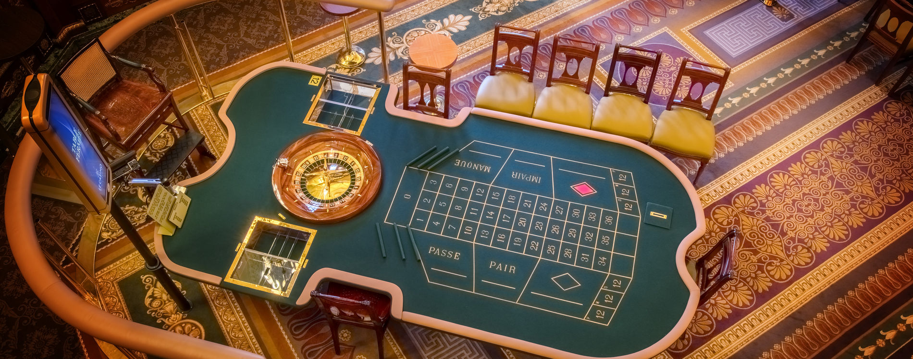

---
output:
  html_document: default
  pdf_document: default
---

```{r setup, include=FALSE}
```

# Lab 5: Discrete Distributions

The following section is taken verbatim from [David Dalpiaz's "Applied Statistics with `R`"](https://daviddalpiaz.github.io/appliedstats/probability-and-statistics-in-r.html#distributions)

### Distributions

When working with different statistical distributions, we often want to make probabilistic statements based on the distribution.

We typically want to know one of four things:

* The density (pdf) at a particular value.
* The distribution (cdf) at a particular value.
* The quantile value corresponding to a particular probability.
* A random draw of values from a particular distribution.

This used to be done with statistical tables printed in the back of textbooks. Now, `R` has functions for obtaining density, distribution, quantile and random values.

The general naming structure of the relevant `R` functions is:

* `dname` calculates density (pdf) at input `x`.
* `pname` calculates distribution (cdf) at input `x`.
* `qname` calculates the quantile at an input probability.
* `rname` generates a random draw from a particular distribution.

Note that `name` represents the name of the given distribution.

## Gambling

We will be using all of the above functions in the following questions.  Specifically, with respect to the discrete distributions we've been studying in class, you might find the functions above where `name` is `binom`, `geom`, `hyper` or `pois` interesting.  Try typing in `?dbinom` and `?rpois` now.

Roulette is a game in which a ball and a spinning wheel are used to generate a random number between 0 and 36 (inclusive).  Players are offered a variety of events on which they can bet.  They can attempt to guess the exact number that will be rolled.  They can attempt to guess whether the number will be even or odd (excluding 0), to guess if the number will be 1-12, 13-24 or 25-36, and various other events related to the precise arrangement of the numbers on a "board" that is visible to players.



Assuming that the ball and wheel are fair:

### Question 1: What is the probability that the random number is between 1 and 12 (inclusive)?

Let $X$ be a random variable so that $X = 3$ if the roulette wheel generates a number between 1 and 12, and $X = 0$ otherwise.

### Question 2: What is $E(X)$?

### Question 3: What is the standard deviation of $X$?

Suppose we run our roulette experiment 10 times.  Let $Y = X_1 + X_2 + X_3 + ... + X_{10}$, where the $X_i$ are defined as in question 1.

### Question 4: What is the distribution of $Y$?

If you can relate a distribution of a random variable to a known distribution, then you have lots of tools at your disposal for calculating probabilities, and you don't have to resort to counting.  Specifically, we can use the `dname` function in `R`, where `name` is the name of our distribution (see top of this document) to compute the pmf at arbitrary points.  Compute the probability that Y is 3 now, using the appropriate function in `R`.  Compute the probability that Y is 6.  Note that these functions are vectorized, so you can compute multiple probabilities at once.  Use the array `1:3` with the function you decided on previously to compute three probabilities, where Y is 3 and also where Y is 6 and also where Y is 9 all in one line of code.  

In `R`, when we multiply two arrays of the same length, the multiplication happens element-wise and returns an array.  Try `c(2,3) * c(4,5)` now to see what this means.  Finally, `R` has a built in `?sum` function that adds up all of the elements of an array.

We can use these operations together to make some computations easier.

### Question 5: What is $E(Y)$?

### Question 6: What is the standard deviation of $Y$?

Before continuing, let's stop for a moment and think about how all of this relates to the game.  Think of $X$ as the payout in dollars of playing the game when making a bet on 1-12.  Suppose that it costs $\$1$ to play the game each time.  What are $Y$, $E(Y)$ and the standard deviation of $Y$ mean in the context of playing a game of roulette?

Suppose we run our roulette experiment 100 times, and $Z = \sum X_i$.  Recall that we typically define a CDF function that can easily compute sums of probabilities over a range of values.  See the notes at the top.  Usually with discrete distributions, it is more performant to use the CDF directly than to actually add up all of the probabilities from the PMF.

### Question 7: What is $P(Z > 100)$?

Suppose that it costs $\$1$ to play the game (so it costs $\$100$ to play 100 times).  Plot a histogram of the distribution of $Z - 100$ by repeatedly sampling from the distribution of $Z$.  You can use the `?rbinom` function to accomplish this.  You might want to make several histograms, varying the value of the parameter $n$.  As you make $n$ larger, you should notice that the histogram doesn't change much... but if you make $n$ REALLY large, then `R` takes a while to build the histogram.  Anyhow, this approximates the distribution of how much money you might make after 100 games of roulette.

### Question 8: What do you think about your prospects when playing roulette for a few hours?

Plot a similar histogram as in question 8, but when playing the game 100,000 times.  Suppose that you aren't the one playing the game, but you are the one charging people a dollar to play, and potentially giving them money if they win.

### Question 9: What do you think about the long-term prospects of managing a roulette table?

Pretend for a moment that you work for the state gaming commission.  It is your duty to ensure that the roulette tables in your state are "fair" in the sense that the probabilities are "equally likely" of getting the various numbers on the wheel.  In particular, people rarely bet on "0", so you are interested in whether the probability of getting a "0" is much more than $\frac{1}{37}$.  Consider a random variable $W = 36$ if the wheel rolls the exact number we have guessed, and $W = 0$ otherwise.  Suppose that we *didn't guess 0*.  Compute the expected value of $W$ if $P({i}) = \frac{1}{37}$ for all numbers $i$ on the wheel (a "fair" wheel).  You should get $36/37$ for this.  Now, compute the expected value of $W$ if $P({0}) = \frac{1}{36}$ and the remaining $P({i})$ are equally likely.

### Question 10: If you never guess "0" (e.g. you always guess 36), how much more money might the casino expect to make per game with the unfair table?

We are still bent on deciding whether the table is "fair".  To this end, we decide to figure out some probabilities of getting various outcomes for fair and unfair tables.  

We've decided that we can compare the probabilities of getting various outcomes by looking at the histograms.  I would be useful for us to plot the histograms "near" each other, so that we can compare nicely.  We're going to color our histograms with some "transparency" and then simply plot them on top of one another.  For $n=30$, we can do the following:

```{r}
# Simulate some data
fair <- rbinom(10000, size=30, prob=1/37)
unfair <- rbinom(10000, size=30, prob=1/36)

# Make some pretty colors.  alpha is "transparency"
blue <- rgb(0.3, 0.3, 0.9, alpha = 0.4)
pink <- rgb(0.9, 0.3, 0.3, alpha = 0.4)

# plot our histograms.  add=TRUE will add your plot to the current plot.
hist(fair, col=blue, breaks=0:7 - 0.5)
hist(unfair, col=pink, breaks=0:7 - 0.5, add=TRUE)
```

For $n = 30, 300, 3000$ and $30000$ create histograms for $\sum_{i=1}^n W_i$ for $P({0}) = \frac{1}{37}$ and also $P({0}) = \frac{1}{36}$ (that's 4 charts and 8 histograms total).  You will need to adjust the breaks to make a nice chart.  

You pick a roulette table at a casino to study.  We sit down to play $n$ games of roulette to further our knowledge of $P({0})$ at this particular table.

Suppose that the ACTUAL probability of "0" on this table IS $\frac{1}{36}$, and not the "fair" value of $\frac{1}{37}$.

### Question 11: Which value of $n$ (out of 30, 300, 3000, 30000) will give us the best chance to actually tell the difference between a table with $P({0}) = \frac{1}{36}$ and a table with $P({0}) = \frac{1}{37}$? Explain your reasoning.

At some point, you've got a job to do and a lot of tables to look at, so you have to stop playing roulette at this table.

You go to another table.  You decide that you only have time to play 300 rounds at this table.  Suppose for a moment that this next table IS actually "fair", so $P({0}) = \frac{1}{37}$.  You are interested in the probability that you get something "quite far" from the expected number of observed 0s in the case that this is a fair table.  This way, you'll be able to identify "unlikely" observations.  Recall from above that the `q` prefix allows you to compute quantiles.  The $p$th **percentile** is the value $x$ for which $p$ percent of observations are less than that value, or, in probability theory, the value for which we have a probability $p$ of getting a value less than or equal to $x$.

### Question 12: For what number of 0s is "the probability of getting *at least* that many 0s" less than 5%?

### Question 13: For what number of 0s is "the probability of getting *at least* that many 0s" less than 1%?

Suppose that, knowing the answers to questions 13 and 14, you actually play roulette for 300 rounds at this table, and observe 20 0s. 

### Question 14: How does this make you feel about your initial supposition that the table is "fair"?  Explain your reasoning.
