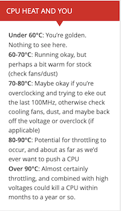

[League of Legends](https://en.wikipedia.org/wiki/League_of_Legends) is a popular video game.

Murphy is a serious League of Legends player. He often plays the game on his computer for hours at a time. 

Murphy plays in a climate controlled room. But he has noticed recently that every time he plays for an extended period of time, his computer becomes hot to the touch.

He worries about the long term health of his computer. He reads [this article](https://www.pcgamer.com/cpu-temperature-overheat/) online and is inspired by the chart from the article that is displayed again here for convenience:

He isn't sure if he needs to take action because he hasn't been logging the temperature of his CPU while he is playing.

So he decides to conduct the following experiment:

Over his next 30 playing experiences, he will record the maximum CPU temperature during his playing experiences.

His goal is to use this data to make inferences about the mean of the maximum CPU temperature achieved during a League of Legends playing session (with his current computer).

Based on the chart, he decides that he will take action to ensure the health of his computer if the conclusions of his inference suggest evidence that the mean max CPU temperature is NOT less than 80 degrees Celsius.

## Question 1: What is the population for this problem?

## Question 2: What is the population parameter being studied?

At this point it is worthwhile to note both benefits and limitations of the study procedure. 

## Question 3: Point out a couple of limitations of the study procedure
some answers:

* The length of Murphys playing experiences may differ; and this may change the distribution of the max temperatures. But Murphy doesn't take this into consideration, because he says that he spends about the same amount of time playing each time.
* The population definition is very general, maybe too general. His computer will change over the course of its life, so if he were to conduct this experiment a year from now, the distribution of his samples may have changed! So when we talk about the population, a more nuanced definition is the distribution of max CPU temperature while playing league of legends playing while his computer is in its current configuration and health.
* Choosing 80 degrees in a little arbitrary. If the true mean of max CPU temp during playing sessions is 79.9 degrees, then under regular conditions (e.g sample size large or population distribution normal), the test we are about to perform should reject the null hypothesis less than 5% of the time when the null is true. This isn't great; Murphy would want to know if the mean of max CPU temp during playing sessions is pretty close to 80 degrees. That would probably be enough to warrant action on his part.

Let $\mu$ denote the mean of the max CPU temperature during a League of Legends playing session for Murphy.

## Question 4: Based on Murhpy's stated goals, state the null and alternative hypotheses.
$H_0: \mu < 80^{\circ} C$
$H_A: \mu \geq 80^{\circ} C$

Let $\bar{X}$, $s$ be the sample mean and sample standard deviation respectively from the 30 playing sessions.

## Question 5: What is the formula for the test statistic?

## Question 6: Let $M_{30}$ denote the test statistic and the plan is to conduct a level $.05$ test. What is the rejection rule for the t test? What is the rejection rule for the test based on the CLT?

## Question 7: Murphy will have to spend a lot of money to service his computer if he concludes it is overheating (i.e $\mu \geq 80^{\circ}$), so he really wants to avoid making this conclusion when it is not true. He also doesn't know anything about the population distribution. Given this concern and his knowledge, should Murphy use the t test or the CLT based test?
answer: t test more conservative, use it

You are conducting the testing procedure for Murphy and you plan to use the t-test. You explain the procedure to Murphy and he has questions for you.

He asks, why did you subtract $80$ in the test statistic. He says this seems kind of arbitrary. Why not subtract $79$ or $81$ for example? What made you choose $80$?

You guide him through the following thought process:

Imagine the population distribution is Normal, and that instead of subtracting $80$ we subtract $x$ and we have a sample of size $n$. So the test statistic is $\frac{\sqrt{n}}{s_n}(\bar{X_n}-x)$ where $\bar{X_n}$ is the sample mean of the $n$ observations and $s_n$ is the sample standard deviation of the $n$ observations. 

Then we have that

\[
P(Reject) = P(\frac{\sqrt{n}}{s_n}(\bar{X_n}-x) > t_{n-1,.95}) = P(\frac{\sqrt{n}}{s_n}(\bar{X_n}-\mu) + \frac{\sqrt{n}}{s_n}(\mu-x) > t_{n-1,.95})
\]

If $\mu < x$, then $\frac{\sqrt{n}}{s_n}(\mu - x) < 0$. Thus

\[
P(\frac{\sqrt{n}}{s_n}(\bar{X_n}-\mu) + \frac{\sqrt{n}}{s_n}(\mu-x) > t_{n-1,.95}) \leq P(\frac{\sqrt{n}}{s_n}(\bar{X_n}-\mu) > t_{n-1,.95}) = ?
\]

Fill in ?. Then answer question $10$

## Question 8: So if $\mu < x$, is the probability of rejecting $\leq$ or $>$ $.05$?

This explains to Murphy why choosing a value of $x$ greater than $80$ would be problematic. But why didn't we choose a value of $x$ smaller than $80$?

You provide him with a hand wavy argument that gives the gist. (Noting that in later probability courses you will be able to eliminate the hand waviness of the following argument)

Recall three things 
<ul>
  <li>By the Law of Large Numbers, for large $n$ the approximation $s_n \approx \sigma$ is valid. </li>
  <li>The CLT (coupled with the Law of Large Numbers to deal with the sample variance) says that for large $n$, the approximation $\frac{\sqrt{n}}{s_n}(\bar{X_n}-\mu) \approx N(0,1)$ is valid</li>
  <li>The $t_{df}$ approaches the $N(0,1)$ as $df \to \infty$ so the approximation $t_{n-1} \approx N(0,1)$ is valid for large $n$</li>
</ul>

So for large (and finite) $n$, the distribution of $\frac{\sqrt{n}}{s_n}(\bar{X_n}-\mu) + \frac{\sqrt{n}}{s_n}(\mu-x) \approx N(\frac{\sqrt{n}}{\sigma}(\mu-x),1)$

So for large (and finite) $n$, the hand wavy approximation $P(Reject) \approx P(N(\frac{\sqrt{n}}{\sigma}(\mu-x),1) > z_{.95})$ is valid.

## Question 9: Given the approximation $P(Reject) \approx P(N(\frac{\sqrt{n}}{\sigma}(\mu-x),1) > z_{.95})$, as $n$ gets large, for $\mu > x$, what number should $P(Reject)$ get very close to?

This explains to Murphy why choosing $x < 80$ is undesirable. He is satisfied now with the choice of $x = 80$.

Now suppose Murphy knows that $n = 30$ (his original sample size) is large enough to justify the approximation for $P(Reject)$ given in the previous question.

## Question 10: Murphy hopes that if $\mu \geq 90$, then he should reject with high probability. Using the appoximation for $P(Reject)$ given in question 11, what is the approximate rejection probability when $\mu = 90$. (Recall his planned testing procedure has $n=30$ and $x = 80$)?

You tell Murphy the number from question $10$ and he says great. That is high enough for me. But what about if $\mu > 90$? Question 11 helps us answer this question.

## Question 11: Let $\mu_1 = 90$ and $\mu_2 > 90$. Is the approximate rejection probability under $\mu = \mu_2$ greater than, equal to, or less than the approximate rejection probability when $\mu = \mu_1$ (when $n$ and $x$ are given)?

Murphy is finally content. He collects the data over the next month and gives it you.

The data is stored in `cpuTemps.csv`. Read the csv into R and conduct the test.

## Question 12: Conduct the originally planned t-test and explain the results to Murphy
